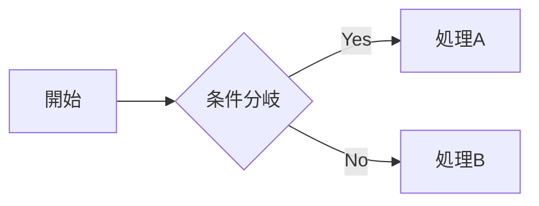
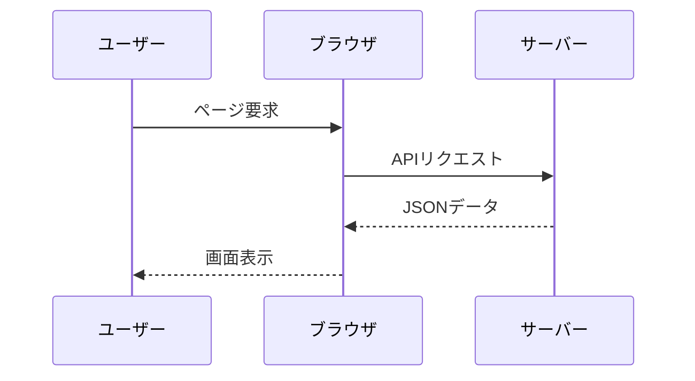

## 1. 概要・基本ルール

* **`:::mermaid`（コードブロック）**：Markdown内でMermaidを描画するための宣言
* **方向の指定（`TD` / `LR`など）**：グラフの進行方向（上から下、左から右など）の定義
* **ノードとID**：要素に固有のIDを割り当て、表示テキストを括弧（`[]`, `()`, `{}`）で指定

---

## 2. フローチャート（`flowchart`）

* **`flowchart TD`**：上から下へ進むフローチャートの宣言
* **`-->`**：矢印によるノード間の接続
* **`id1[長方形] / id2(丸角) / id3{ひし形}`**：括弧の形状によるノードのデザイン変更
* **`-- テキスト -->`**：線の上に文字を載せる記述

---

## 3. シーケンス図（`sequenceDiagram`）

* **`sequenceDiagram`**：時系列の処理を表すシーケンス図の宣言
* **`participant <名前>`**：登場人物（オブジェクト）の定義
* **`->>` / `-->>**`：実線矢印（リクエスト）と破線矢印（レスポンス）の表現
* **`activate / deactivate`**：生存線（処理中ブロック）の活性化・非活性化

---

## 4. クラス図（`classDiagram`）

* **`classDiagram`**：システムの構造を表すクラス図の宣言
* **`class <クラス名>`**：クラスの定義
* **`<型> <変数名>` / `<関数名>()**`：プロティやメソッドの定義
* **`<--` / `*--` / `o--**`：継承・コンポジション・集約などの関係性の表現

---

## 5. ガントチャート（`gantt`）

* **`gantt`**：プロジェクトの工程管理を表すガントチャートの宣言
* **`title <タイトル>`**：チャート全体のタイトル設定
* **`section <セクション名>`**：タスクのグループ分け
* **`<タスク名> : <ステータス>, <開始日>, <期間>`**：スケジュールの具体的な記述

---

## 6. その他の便利なグラフ

* **`gitGraph`**：Gitのブランチやコミットの履歴の可視化
* **`pie`**：円グラフによる割合の表現
* **`mindmap`**：アイデアの整理に便利なマインドマップの作成