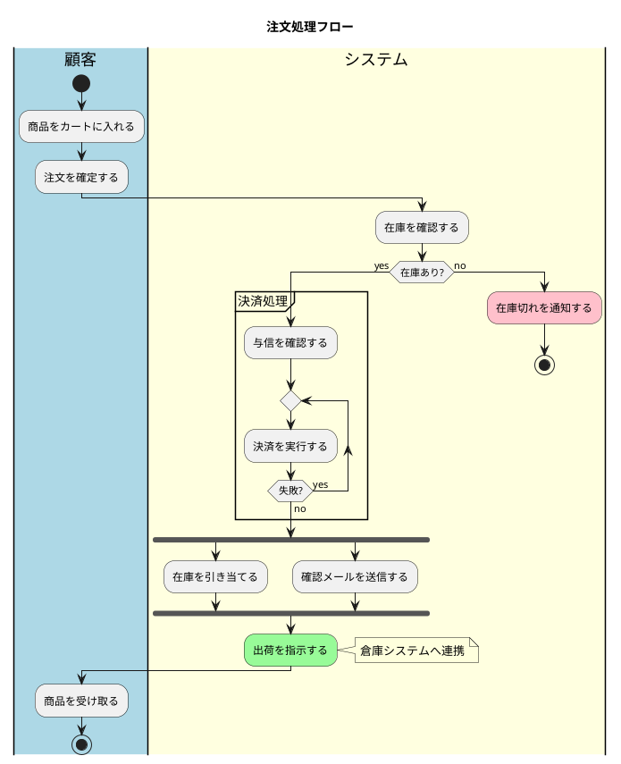

## PlantUML アクティビティ図

業務フローやプログラムの処理手順を、開始から終了までの流れとして表現する図。`start`/`stop` を起点に `:アクション;` を縦に並べる「新文法（New Syntax）」を中心に解説する。

---

## 1. 基本構造とアクション

* **`@startuml` / `@enduml`**：PlantUML図の開始と終了の宣言
* **`start`**：フローの開始点（黒丸）を配置
* **`stop`**：フローの終了点（黒丸＋輪）を配置
* **`end`**：フローの終了（フロー終端マーク）を配置。`stop` との使い分けで終了種別を表現
* **`:アクション;`**：1つの処理（アクション）を表す。セミコロンで終端
* **`:複数行の\nアクション;`**：`\n` を含めると複数行のアクションラベルを表現
* **`-> ラベル;`**：直前のアクションから次への矢印にラベル（注記）を付与

---

## 2. 条件分岐（if / elseif / switch）

* **`if (条件) then (yes)`**：条件分岐の開始。`then` の括弧内は分岐ラベル
* **`else (no)`**：条件が偽の場合の分岐
* **`endif`**：if 分岐の終了
* **`elseif (条件2) then (yes)`**：複数条件の連鎖（else-if）を表現
* **`switch (式)` / `case (値)` / `endswitch`**：多分岐（スイッチ）の表現
* **`if (条件) then (yes)` の後に `stop`**：分岐の片側だけで処理を打ち切る表現

---

## 3. 繰り返し（while / repeat / for）

* **`while (条件)` … `endwhile`**：前判定ループ（先に条件を評価）の表現
* **`while (条件) is (yes)` … `endwhile (no)`**：ループの継続・脱出条件にラベルを付与
* **`repeat` … `repeat while (条件)`**：後判定ループ（最低1回実行）の表現
* **`repeat` … `backward:処理;` `repeat while (条件)`**：ループ末尾で戻る処理を `backward` で明示
* **`break`**：ループ内からの脱出（ブレーク）を表現

---

## 4. 並行処理（fork / split）

* **`fork`**：並行処理の分岐開始（スレッドの分岐）
* **`fork again`**：並行する別の処理ブランチを追加
* **`end fork`**：並行処理の合流（同期バー）
* **`end merge`**：合流時に同期せず単純にマージする場合の終了
* **`split` / `split again` / `end split`**：分割（複数の独立フローへの分岐）を表現
* **`detach`**：合流せずにフローを切り離す（矢印を途切れさせる）

---

## 5. グループ化とスイムレーン

* **`partition 名前 { … }`**：処理を枠で囲みグループ化（パーティション）
* **`partition "名前" #色 { … }`**：パーティションに背景色を指定
* **`group 名前 { … }`**：パーティションと同様のグループ枠
* **`|レーン名|`**：スイムレーン（担当者・役割ごとの縦帯）を定義
* **`|#色|レーン名|`**：スイムレーンに背景色を指定して切り替え
* **`|既存レーン名|`**：定義済みレーンへ処理を戻す（同名で再指定）

---

## 6. 注釈・装飾と完全サンプル

* **`note left` / `note right`**：直前のアクションの左右に注釈を配置（複数行可、`end note` で終了）
* **`floating note left:テキスト`**：フローと線で結ばない浮遊ノートを配置
* **`#色:アクション;`**：アクションの背景色を指定（例 `#palegreen:`）
* **`:アクション;<<装飾>>`**：ステレオタイプ的な装飾を付与
* **`title タイトル文`**：図全体のタイトルを表示

