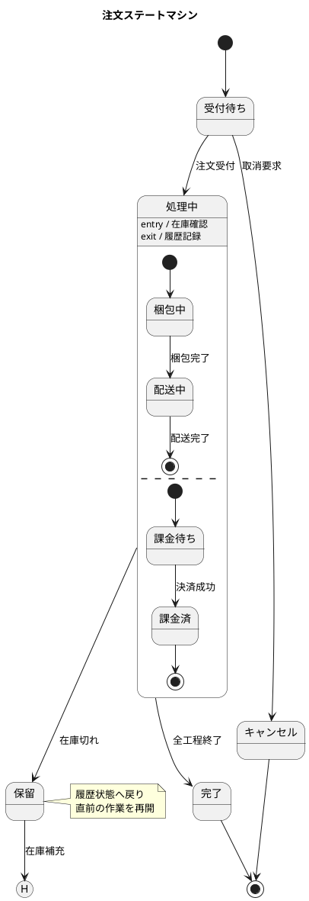

## PlantUML ステート図

オブジェクトが取りうる「状態」と、イベントによる「状態遷移」を表現する図（状態機械図）。`[*]` の開始・終了、`state` での状態定義、`-->` での遷移を基本に、複合状態・履歴・並行状態まで解説する。

---

## 1. 基本構造と状態定義

* **`@startuml` / `@enduml`**：PlantUML図の開始と終了の宣言
* **`[*]`**：開始状態（左辺で使うと初期状態、右辺で使うと終了状態）
* **`state 状態名`**：状態を明示的に定義
* **`state "表示ラベル" as 別名`**：長い状態名に短いエイリアス（別名）を割り当て
* **`state 状態名 <<装飾>>`**：`<<choice>>` `<<fork>>` `<<end>>` などの特殊状態を表現
* **`hide empty description`**：中身が空の状態の説明領域を非表示にして見た目を整える

---

## 2. 状態遷移（矢印）

* **`A --> B`**：状態 A から状態 B への遷移（実線矢印）
* **`A --> B : イベント`**：遷移にトリガとなるイベント名（ラベル）を付与
* **`A --> B : イベント [ガード] / アクション`**：UML 準拠でガード条件と実行アクションを併記
* **`[*] --> A`**：初期状態から最初の状態への遷移
* **`A --> [*]`**：状態 A から終了状態への遷移
* **`A -left-> B` / `A -down-> B`**：矢印の向き（方向）を指定してレイアウトを調整

---

## 3. 状態の説明とノート

* **`状態名 : 説明文`**：状態の枠内に説明（内部アクティビティ等）を追記
* **`状態名 : entry / 処理`**：入場時の動作（entry アクション）を記述
* **`状態名 : exit / 処理`**：退場時の動作（exit アクション）を記述
* **`note left of 状態名 : テキスト`**：指定状態の左にノートを配置
* **`note right of 状態名 : テキスト`**：指定状態の右にノートを配置（複数行は `end note` で終了）
* **`note "テキスト" as N`**：独立した浮遊ノートを定義し線で結ぶ

---

## 4. 複合状態（ネスト）

* **`state 親 { … }`**：状態の中に子状態を持つ複合状態（コンポジット状態）を定義
* **`state 親 { [*] --> 子 }`**：複合状態内の初期状態を `[*]` で指定
* **`子 --> [*]`**：複合状態内での終了（親状態からの脱出）を表現
* **`親 --> 別状態`**：複合状態全体を1つの単位として外部へ遷移
* **入れ子の `state`**：複合状態の中にさらに複合状態を入れて多階層を表現

---

## 5. 履歴・並行・分岐

* **`[H]`**：浅い履歴（History）状態。複合状態に戻った際、直前の子状態を復元
* **`[H*]`**：深い履歴（Deep History）状態。ネストした最深部の状態まで復元
* **`--`**：複合状態内を水平線で区切り、並行状態（直交領域・同時進行）を表現
* **`state fork1 <<fork>>`**：並行遷移への分岐（フォーク）擬似状態
* **`state join1 <<join>>`**：並行遷移の合流（ジョイン）擬似状態
* **`state c1 <<choice>>`**：ガード条件による分岐（チョイス）擬似状態

---

## 6. 装飾・レイアウトと完全サンプル

* **`skinparam state { … }`**：状態の色・フォントなどスタイルを一括設定
* **`state 状態名 #色`**：個別の状態に背景色を指定
* **`scale 値`**：図全体の表示倍率を指定
* **`title タイトル文`**：図全体のタイトルを表示
* **`left to right direction`**：レイアウト方向を左→右に変更
* **`'コメント`**：行頭の `'` 以降はコメント（描画されない）

