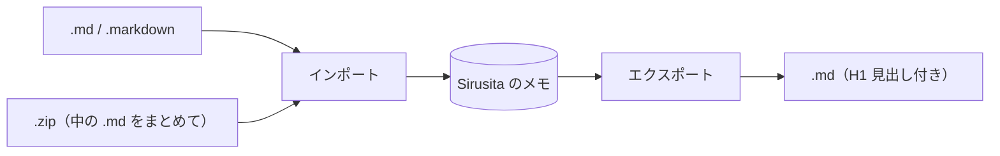

## Sirusita の使い方

Sirusita は、マークダウンでメモを書いてプレビューで確認できるメモアプリです。
このヘルプは、サイドバー上部の **?** ボタンからいつでも開けます。

---

## 1. 画面の構成

```d2
direction: right
sidebar: サイドバー {
  actions: "新規 / インポート / ?"
  tags: タグフィルタ
  list: マークダウン一覧
}
main: メイン {
  toolbar: "タイトル・タグ・エクスポート・削除"
  tabs: "編集 / プレビュー / 分割"
  body: エディタ・プレビュー
  toc: 見出し一覧
}
sidebar.list -> main.body: 選択したメモを表示
```

* **サイドバー（左）**：メモの作成・インポート、タグでの絞り込み、メモの一覧
* **メイン（右）**：選んだメモのタイトル・タグ・本文の編集とプレビュー
* サイドバーとメインの境目をドラッグすると、サイドバーの幅を変えられます（幅は次回も保持）

---

## 2. メモを書く

* サイドバー上部の **新規** ボタン（＋の付いた紙のアイコン）で新しいメモを作ります
* 上部の **タイトル** 欄にタイトル、本文はエディタにマークダウンで書きます
* 本文は入力が止まって約 0.5 秒後に **自動で保存** されます。保存ボタンはありません
* タイトルとタグは、入力欄から別の場所へ移動したとき（フォーカスが外れたとき）に保存されます
* 一覧は **更新日時の新しい順** に並びます

---

## 3. 表示の切り替え

タブで表示を切り替えます（選んだ表示は次回も保持）。

| タブ | 内容 |
|---|---|
| 編集 | エディタだけを表示 |
| プレビュー | 表示結果だけを表示 |
| 分割 | エディタとプレビューを左右に並べる。スクロール位置が連動 |

* **A- / A+**：プレビューの文字サイズを変更（プレビュー・分割のとき）
* **☰ 見出し**：見出しの一覧を右側に表示。見出しをクリックするとその位置へジャンプ
* プレビュー内のリンクは、外部のブラウザで開きます

---

## 4. タグで整理する

* タイトルの下の **タグ** 欄に、カンマ区切りで入力します（例: `仕事, 議事録`）
* サイドバーの **タグフィルタ** でタグを選ぶと、そのタグのメモだけが一覧に出ます
  * **全て**：すべてのメモ / **タグ無し**：タグが付いていないメモ
* 各タグの右の数字は、そのタグ（配下のタグを含む）が付いたメモの数です

### 階層タグ

`/` で区切ると階層になります。

```
プログラミング/Go
プログラミング/Rust
仕事/2026/議事録
```

* タグフィルタはツリーになり、▸ / ▾ で開閉できます（開閉状態は次回も保持）
* 親のタグ（例: `プログラミング`）を選ぶと、配下のタグ（`プログラミング/Go` など）のメモもまとめて表示されます
* `a / b` や `a//b` のような余分な空白・スラッシュは、保存時に `a/b` に整えられます

### タグ名の変更・統合

* タグにマウスを乗せると出る **✎** から、タグ名を変更できます
* 配下のタグもまとめて付け替わります（例: `PlantUML` → `図表/PlantUML`）
* 変更先が既存のタグと同じなら、2 つのタグは **統合** されます（表記ゆれの統一に便利）
* タグ名を変更しても、メモの作成日時・更新日時は変わりません

---

## 5. インポートとエクスポート



* **インポート**：サイドバー上部の **インポート** ボタン（下向き矢印のアイコン）から、マークダウンや ZIP を取り込みます。複数選択でき、ファイルをウィンドウへ **ドラッグ＆ドロップ** しても取り込めます
  * タイトルは front matter の `title` → 本文の最初の `#` 見出し → ファイル名 の順に決まります
  * Sirusita でエクスポートしたファイルや同梱のサンプル集（`sirusita-contents.zip`）は、タグと作成・更新日時もそのまま取り込まれます
* **エクスポート**：タイトル右側の **ダウンロード** ボタンで、開いているメモを `.md` ファイルとして保存します（先頭にタイトルの `#` 見出しが付きます）
* **削除**：赤い **ごみ箱** ボタン。確認のあと削除します（元に戻せません）

---

## 6. 書ける記法

通常のマークダウン（見出し・リスト・表・リンク・画像・引用など）に加えて、次の表示に対応しています。
くわしい書き方はサンプル集の「マークダウン」「数式」「Mermaid」「D2」の各メモを参照してください。

### 数式（KaTeX）

文中は `$...$`、独立した行は `$$...$$` で囲みます。

```
$E = mc^2$
```

表示: $E = mc^2$

$$
\int_0^1 x^2 \, dx = \frac{1}{3}
$$

### コード（シンタックスハイライト）

` ``` ` の後に言語名を書くと色が付きます。

```go
func main() {
    fmt.Println("Hello, Sirusita")
}
```

### 図（Mermaid / D2）

` ```mermaid ` や ` ```d2 ` で囲んだ部分が図として表示されます。

````
```d2
ユーザー -> Sirusita: メモを書く
Sirusita -> ファイル: 保存
```
````

表示:

```d2
ユーザー -> Sirusita: メモを書く
Sirusita -> ファイル: 保存
```

---

## 7. メモの保存場所

| 版 | 保存場所 |
|---|---|
| Windows / Linux 版 | ユーザーフォルダーの `.sirusita/notes/`（1 メモ 1 ファイルのマークダウン） |
| Web 版 | お使いのブラウザ内（IndexedDB）。サーバーには送られません |

* メモの内容が外部に送られることはありません。Web 版が通信するのは、ページと、D2 の図・インポートの処理に使うプログラムを読み込むときだけです
* Web 版のメモはブラウザごとに別々です。サイトデータを消去すると失われるので、必要なメモはエクスポートしてください
* 保存されるファイルの形式（front matter 付きマークダウン）は次のとおりです

```markdown
---
title: "メモのタイトル"
tags:
  - "プログラミング/Go"
created: 2026-10-09T10:00:00+09:00
modified: 2026-10-09T12:00:00+09:00
sirusita: "1"
---

本文（マークダウン）
```
